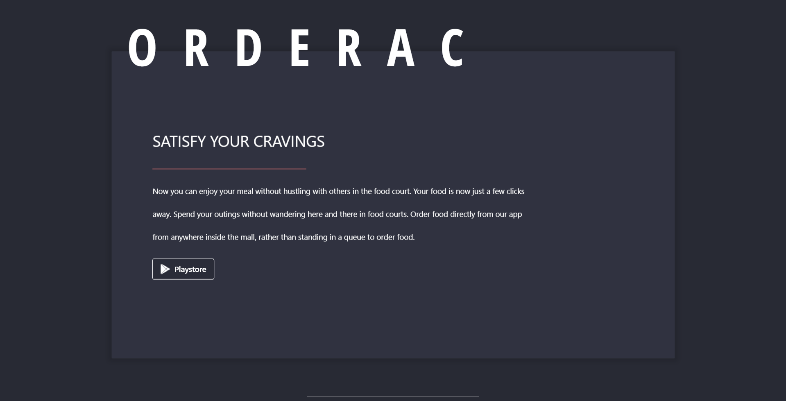
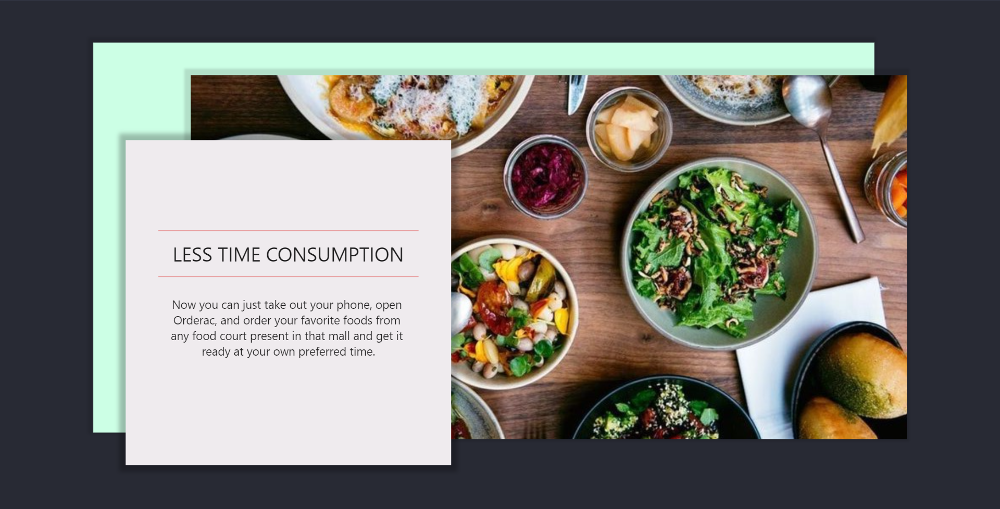

Orderac is an app that lets you order food from the food courts from anywhere inside a mall. And the website will be available to the respective food courts from where they can see their respective list of orders.

## Links
- Visit website: [orderac.co](orderac.co)
- Demo video: [youtu.be/orderac](https://youtu.be/GBYRm5XFyt8)
- Find the app here: [github.com/inaxia/orderac_app](github.com/inaxia/orderac_app) 
- Try the app: [framer.com/share/orderac-app](https://framer.com/share/Orderac-app--8zkuJSTDPVa8S3FI05aQ/L0fpoTGsC?fullscreen=1)
- See the presentation: [canva.com/design/orderac](https://www.canva.com/design/DAEUhuTtEKU/SJa0MfLFq-r9aUyK96Whzg/view?utm_content=DAEUhuTtEKU&utm_campaign=designshare&utm_medium=link&utm_source=sharebutton)

## How does Orderac help?
Let's assume you entered a mall and found that it was fully crowded, you thought of having some food and went to the food court but you found a huge queue there. After waiting for a long while, you ordered some food and now you are waiting for your food but you have to go shopping also.

WHAT WILL YOU DO NOW?

Now, let's consider another situation...
This time you entered a crowded mall, took out your phone and opened the Orderac app, and ordered some food from the same crowded food court through the app, and boom!!
Now you can go shopping and can buy your favorite clothes, you can go and watch your favorite movie. And then, you get a notification that your food is ready, you go to the food court and take your order and can enjoy your meal happily.

## Main features of Orderac
1. Hassle free food
2. Less time consumption
3. Get food at preset time

## Technologies used
1. Flutter
2. Firebase 

## Snapshots

## Community
[Code of Conduct](https://github.com/inaxia/attendance_using_face_recognition/blob/master/CODE_OF_CONDUCT.md)  
[Contributing to Inaxia](https://github.com/inaxia/attendance_using_face_recognition/blob/master/CONTRIBUTING.md)

## Steps to run
1. Fork this repo
2. Clone the forked repo
3. Open terminal, make sure you are in directory '..\orderac_web' 
4. Run the commands below:
    1. `flutter channel beta`
    2. `flutter upgrade`
    3. `flutter run` -> it will ask 'In which browser you want to run your app'

