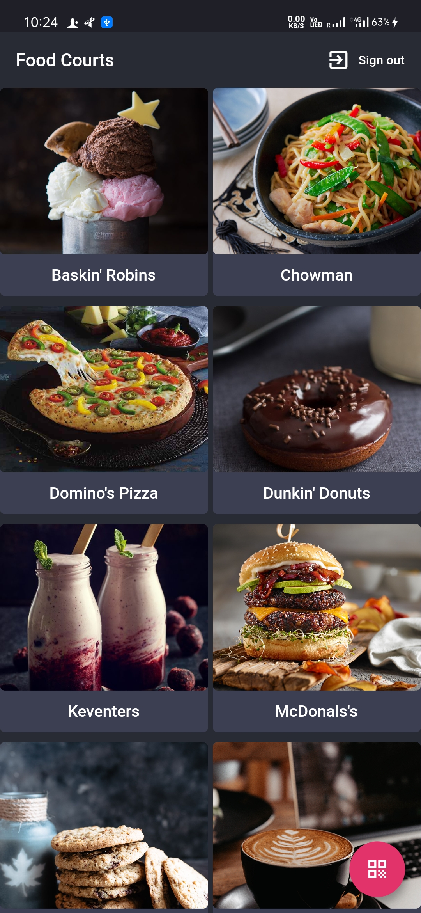
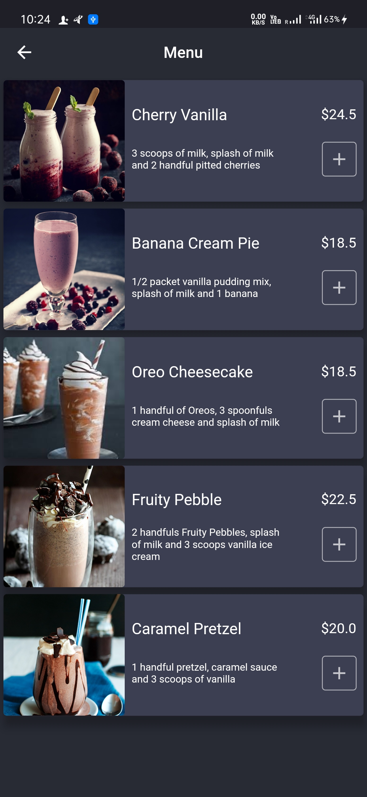
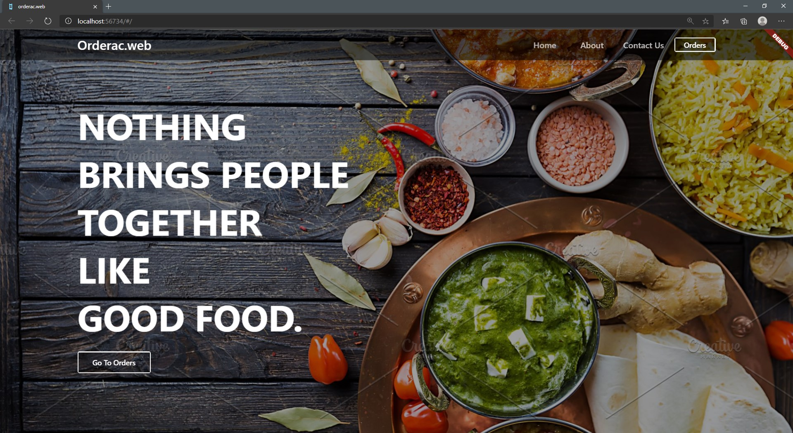

<p align="center">
    <a href="#"></a>
    <h2 align="center">why starve when you have us</h2>
</p>


<p align="center">
    <a href="https://dart.dev/"></a>
    <a href="https://flutter.dev/"></a>
    <a href="https://firebase.google.com/"></a>
</p>


## Description
We know that during this COVID time many industries are failing to grow as they were growing before.<br>
But some are growing faster than ever before.<br>
And one of them is **Food industry**.

Whenever we go to a **mall**, the very first things we find is crowd, especially in **Food Courts**.<br> 
There are more people standing in a food court than the people having a seat and eating their food.

We are creating an App & a Website, which people can use to **order food directly** from our app from anywhere **inside the mall**, rather than standing in a queue to order their food.<br> 
And the website will be available to the food courts from where food courts can see their respective list of orders.

- This will decrease the crowd in the food courts
- This will make the food ordering process faster
- Food courts will get more orders as user don't have to stand for very long
- This can be implemented in every mall

[](https://github.com/inaxia/orderac/stargazers)
[](https://github.com/inaxia/orderac/network)
[](https://github.com/inaxia/orderac/issues)


## Installation

**`orderac` -> app**<br>
**`orderac_web` -> web**

1. Fork this repo
2. Clone the forked repo
3. Open the main/parent `orderac` folder

**For running app:**<br>
Run the following commands:

1. `cd .\orderac\` -> after running this, directory should be '..\orderac\orderac'
2. `flutter channel stable`
3. `flutter upgrade`
4. `flutter run` -> make sure an android/emulator device is connected

**For running web:**<br>
If you want to run app & web simultaneously, you have to open a new window of any IDE and then run the following commands:

1. `cd ..` -> if you are still in '..\orderac\orderac'
2. `cd .\orderac_web\` -> after running this, directory should be '..\orderac\orderac_web'
3. `flutter channel beta`
4. `flutter upgrade`
5. `flutter run` -> it will ask 'In which browser you want to run your app'


## Visual
**`orderac` :**<br>


<br>
**`orderac_web` :**<br>



## Community
**[Code of Conduct](https://github.com/inaxia/attendance_using_face_recognition/blob/master/CODE_OF_CONDUCT.md)**<br>
**[Contributing to Inaxia](https://github.com/inaxia/attendance_using_face_recognition/blob/master/CONTRIBUTING.md)**


## License
```
MIT License

Copyright (c) 2020 inaxia

Permission is hereby granted, free of charge, to any person obtaining a copy
of this software and associated documentation files (the "Software"), to deal
in the Software without restriction, including without limitation the rights
to use, copy, modify, merge, publish, distribute, sublicense, and/or sell
copies of the Software, and to permit persons to whom the Software is
furnished to do so, subject to the following conditions:

The above copyright notice and this permission notice shall be included in all
copies or substantial portions of the Software.

THE SOFTWARE IS PROVIDED "AS IS", WITHOUT WARRANTY OF ANY KIND, EXPRESS OR
IMPLIED, INCLUDING BUT NOT LIMITED TO THE WARRANTIES OF MERCHANTABILITY,
FITNESS FOR A PARTICULAR PURPOSE AND NONINFRINGEMENT. IN NO EVENT SHALL THE
AUTHORS OR COPYRIGHT HOLDERS BE LIABLE FOR ANY CLAIM, DAMAGES OR OTHER
LIABILITY, WHETHER IN AN ACTION OF CONTRACT, TORT OR OTHERWISE, ARISING FROM,
OUT OF OR IN CONNECTION WITH THE SOFTWARE OR THE USE OR OTHER DEALINGS IN THE
SOFTWARE.
```


## Support
<br>
**If you like our project, don't forget to give it a ⭐**
